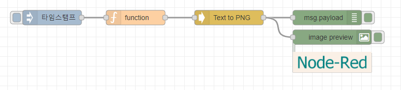

TEXT to PNG NodeRED Node
=====================

text2png Wrapper 

https://github.com/tkrkt/text2png


Install
-------

`npm install node-red-contrib-text2png`

-  install image output lib additionally 
- `npm install node-red-contrib-image-output`

Example 
-------
```javascript
msg = {};
msg.payload = 'Node-Red';
msg.options = {
    font: '80px Futura',
    color: 'teal',
    backgroundColor: 'linen',
    lineSpacing: 10,
    padding: 20
};
return msg;
```

<a href="https://www.buymeacoffee.com/gagagiga" target="_blank"></a>


Result 
-------


Flow Sample
-------
```json
[{"id":"9eef4c84.d7f75","type":"inject","z":"44e78528.4d783c","name":"","props":[{"p":"payload"},{"p":"topic","vt":"str"}],"repeat":"","crontab":"","once":false,"onceDelay":0.1,"topic":"","payload":"","payloadType":"date","x":230,"y":40,"wires":[["fb804d02.94c04"]]},{"id":"41191b20.45c244","type":"text2png","z":"44e78528.4d783c","name":"Text to PNG","x":590,"y":40,"wires":[["dcbdc78.94d4638","264b7239.a67e1e"]]},{"id":"dcbdc78.94d4638","type":"debug","z":"44e78528.4d783c","name":"","active":true,"tosidebar":true,"console":false,"tostatus":false,"complete":"false","statusVal":"","statusType":"auto","x":790,"y":40,"wires":[]},{"id":"fb804d02.94c04","type":"function","z":"44e78528.4d783c","name":"","func":"msg = {};\nmsg.payload = 'Node-Red';\nmsg.options = {\n    font: '80px Futura',\n    color: 'teal',\n    backgroundColor: 'linen',\n    lineSpacing: 10,\n    padding: 20\n};\nreturn msg;","outputs":1,"noerr":0,"initialize":"","finalize":"","x":400,"y":40,"wires":[["41191b20.45c244"]]},{"id":"264b7239.a67e1e","type":"image","z":"44e78528.4d783c","name":"","width":160,"data":"payload","dataType":"msg","thumbnail":false,"active":true,"pass":false,"outputs":0,"x":800,"y":80,"wires":[]}]
```
